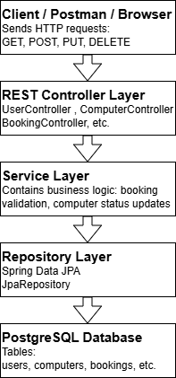
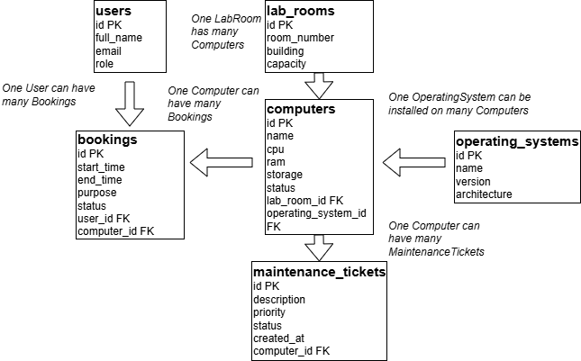
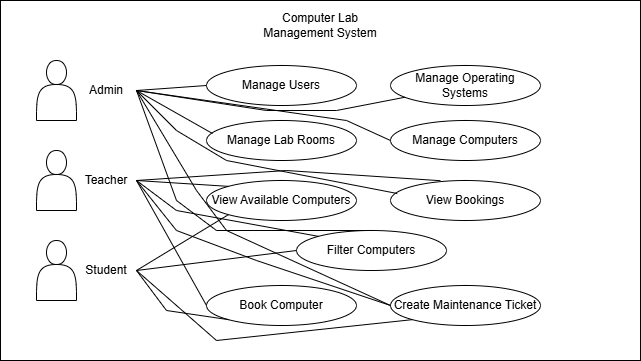
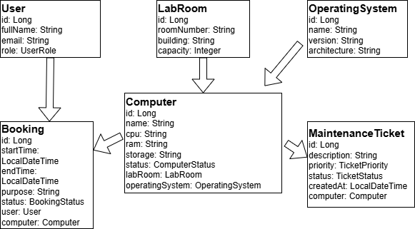

# Computer Lab Management System

## Project Description

Computer Lab Management System is a Java Spring Boot web application for managing computer laboratories.

The system helps to manage lab rooms, computers, operating systems, users, bookings, and maintenance tickets.  
It can be used in schools, universities, or computer labs where computers need to be tracked, booked, and maintained.

## Main Features

- Manage users
- Manage lab rooms
- Manage operating systems
- Manage computers
- Create and manage bookings
- Create and manage maintenance tickets
- Filter computers by status
- Filter computers by lab room
- REST API support
- PostgreSQL database integration
- Web dashboard
- Browser-based frontend
- Thymeleaf pages for managing data
- User registration
- User login and logout
- Spring Security authentication
- BCrypt password hashing
- Role-based access control
- Admin-only users page

## Frontend

The project includes a web frontend built with Thymeleaf and Bootstrap.

In the previous version, the system was mainly a REST API backend tested with Postman.  
Now the system also has browser-based pages for managing the computer lab data.

The frontend includes:

- Dashboard page
- Computers page
- Lab Rooms page
- Operating Systems page
- Bookings page
- Maintenance Tickets page

The dashboard can be opened in the browser:

http://localhost:8080/dashboard

## Frontend Implementation Details

The frontend was added on top of the existing Spring Boot REST API.

The REST API controllers are still available for JSON responses and Postman testing.  
In addition, MVC controllers were added for browser-based pages using Thymeleaf.

Main frontend-related changes:

- Added Thymeleaf dependency in `pom.xml`
- Added MVC controllers in `src/main/java/com/example/computerlab/controller/web`
- Added DTO classes in `src/main/java/com/example/computerlab/dto`
- Added CSS styles in `src/main/resources/static/css/app.css`
- Added Thymeleaf HTML templates in `src/main/resources/templates`

Main frontend files:

- `dashboard.html` - main dashboard page
- `fragments/layout.html` - shared layout with sidebar and common page structure
- `computers/list.html` - computers list page
- `computers/form.html` - create/edit computer form
- `labrooms/list.html` - lab rooms page
- `operating-systems/list.html` - operating systems page
- `bookings/list.html` - bookings page
- `maintenance-tickets/list.html` - maintenance tickets page

The frontend uses the existing Service layer to load data from the database.  
This keeps the project architecture clean because the MVC controllers do not work directly with repositories.

The project can now be used in two ways:

1. Through REST API endpoints using Postman.
2. Through the browser using Thymeleaf frontend pages.

## Authentication and Security

The project includes authentication using Spring Security.

Users can register, log in, and log out through the web interface.

Authentication features:

- User registration
- User login
- User logout
- Password hashing with BCrypt
- Protected frontend pages
- Role-based access control
- Admin-only Users page

New registered users receive the STUDENT role by default.  
This is safer because users cannot give themselves ADMIN or TEACHER role during registration.

Only users with ADMIN role can access the Users page:

```text
http://localhost:8080/users
```

## Technologies Used

- Java
- Spring Boot
- Spring Web
- Spring Security
- Spring Data JPA
- PostgreSQL
- Thymeleaf
- Bootstrap
- Lombok
- Maven
- Postman
- Git and GitHub

## Project Architecture

The project uses layered architecture:

Controller -> Service -> Repository -> Database

Controller receives HTTP requests from the client.

Service contains the business logic of the application.

Repository communicates with the database using Spring Data JPA.

The project now supports both REST API and web frontend.

REST controllers are used for API endpoints.  
MVC controllers are used for Thymeleaf frontend pages.

This means the project can be tested in two ways:

- Through Postman using REST API
- Through browser using the web interface

## System Design Diagrams

This project includes several diagrams that explain the system design, database structure, user roles, and Java classes.

### 1. Architecture Diagram

This diagram shows the layered architecture of the project: Controller, Service, Repository, and Database.



### 2. Database ERD Diagram

This diagram shows the database tables and relationships between them.



### 3. UML Use Case Diagram

This diagram shows the main actors of the system and what actions they can perform.



### 4. UML Class Diagram

This diagram shows the main Java entity classes and their relationships.



## Business Logic

The project is not only simple CRUD.

Main business rules:

1. A computer cannot be booked if it is BROKEN or under MAINTENANCE.
2. When a booking is created, the computer status changes to BOOKED.
3. When a maintenance ticket is created, the computer status changes to MAINTENANCE.

## Main Entities

The project contains six main entities:

1. User
2. LabRoom
3. OperatingSystem
4. Computer
5. Booking
6. MaintenanceTicket

## Database Relationships

- One LabRoom can have many Computers.
- One OperatingSystem can be installed on many Computers.
- One User can have many Bookings.
- One Computer can have many Bookings.
- One Computer can have many MaintenanceTickets.

## API Endpoints

### Users

GET /api/users  
GET /api/users/{id}  
POST /api/users  
PUT /api/users/{id}  
DELETE /api/users/{id}

### Lab Rooms

GET /api/labrooms  
GET /api/labrooms/{id}  
POST /api/labrooms  
PUT /api/labrooms/{id}  
DELETE /api/labrooms/{id}

### Operating Systems

GET /api/operating-systems  
GET /api/operating-systems/{id}  
POST /api/operating-systems  
PUT /api/operating-systems/{id}  
DELETE /api/operating-systems/{id}

### Computers

GET /api/computers  
GET /api/computers/{id}  
POST /api/computers  
PUT /api/computers/{id}  
DELETE /api/computers/{id}  
GET /api/computers/status/{status}  
GET /api/computers/labroom/{labRoomId}

### Bookings

GET /api/bookings  
GET /api/bookings/{id}  
POST /api/bookings  
PUT /api/bookings/{id}  
DELETE /api/bookings/{id}

### Maintenance Tickets

GET /api/maintenance-tickets  
GET /api/maintenance-tickets/{id}  
POST /api/maintenance-tickets  
PUT /api/maintenance-tickets/{id}  
DELETE /api/maintenance-tickets/{id}

## Example JSON Requests

### Create User

{
"fullName": "Baidarkhan Student",
"email": "baidar@example.com",
"role": "STUDENT"
}

### Create Lab Room

{
"roomNumber": "305",
"building": "Main Building",
"capacity": 25
}

### Create Operating System

{
"name": "Windows",
"version": "11",
"architecture": "64-bit"
}

### Create Computer

{
"name": "PC-101",
"cpu": "Intel Core i5",
"ram": "16 GB",
"storage": "512 GB SSD",
"status": "AVAILABLE",
"labRoom": {
"id": 1
},
"operatingSystem": {
"id": 1
}
}

### Create Booking

{
"startTime": "2026-05-05T10:00:00",
"endTime": "2026-05-05T12:00:00",
"purpose": "Operating Systems practical lesson",
"user": {
"id": 1
},
"computer": {
"id": 1
}
}

### Create Maintenance Ticket

{
"description": "Computer has keyboard problem",
"priority": "MEDIUM",
"computer": {
"id": 1
}
}

## How to Run the Project

1. Clone the repository.

git clone https://github.com/your-username/computer-lab-management-system.git

2. Open the project in IntelliJ IDEA.

3. Create a PostgreSQL database:

CREATE DATABASE computer_lab_db;

4. Create application.properties in this folder:

src/main/resources/application.properties

5. Copy the content from application-example.properties and replace YOUR_PASSWORD_HERE with your PostgreSQL password.

6. Run the main class:

ComputerlabApplication.java

7. Test the API using Postman.

8. Open the frontend in the browser:

```text
http://localhost:8080/dashboard
```

9. Register a new user:

```text
http://localhost:8080/register
```

10. Log in:

```text
http://localhost:8080/login
```

## Current Role Logic

The current role logic works as follows:

- New users register as STUDENT by default.
- STUDENT users can access normal frontend pages such as dashboard, computers, bookings, and maintenance tickets.
- ADMIN users can access the admin-only Users page.
- The Users page is protected with role-based access control.
- If a non-admin user tries to open `/users`, the system returns 403 Forbidden.

Future improvement:

- Add admin role management page where ADMIN can change users' roles from STUDENT to TEACHER or ADMIN directly from the frontend.

## Author

This project was developed individually as a final project for Computer Architecture and Operating Systems course.